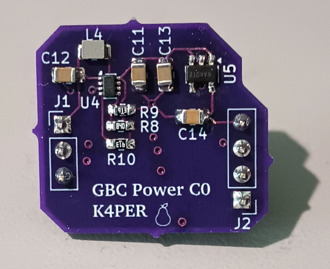
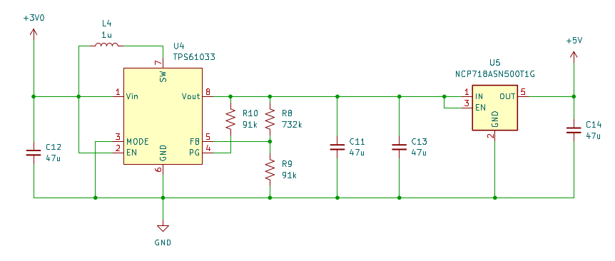
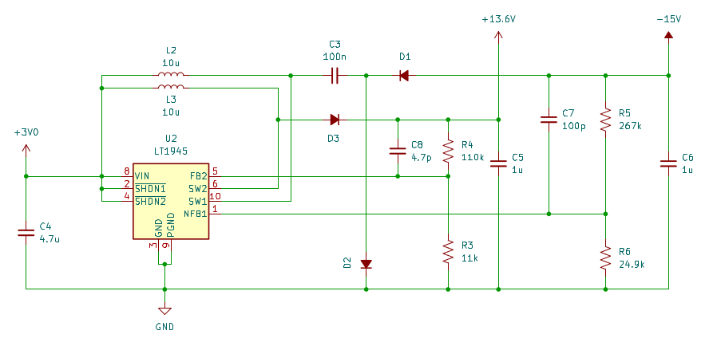

# POWER_GBC

Power supply designed to be a drop-in replacement for the GameBoy Color (GBC) power supply. 

This design was motivated due to obsolescence of components on the GBC power supply making the existing supply unrepairable. A power supply failure would therefore brick the GBC, either requiring acquisition of a functional power supply or use of the motherboard for parts. I have acquired multiple GBCs that have failed power supplies, so this seems to be a common failure point, specifically for the transformer on the supply. 

# Design

Full schematic can be found here: [Schematic](schematic_revC0)

The PWA was designed to use the same footprint as the existing power supply. It is split between two switchmode power ICs that generate the output voltages needed. Both supplies are layed out based on the manufacturers suggestions in the component datasheets. 

Top side: +5V power supply

The +5V supply, which powers the microprocessor and most sensors used by the GBC, is generated by the TI TPS61033 boost converter. The boost converter is biased to +5.5V to allow a following linear regulator to generate the +5V. All revisions of the board were in this design. 

- The linear regulator is required for stable operation of the processor.
- Do not use part TPS7A2050PDBVR for U5! This part is pin-to-pin compatable, but I had issues with the IC disabling the output in use. I am still working to understand why this was occuring, working theory is that the 47uF on the output generated too much current at start up, causing the current protection circuitry to disable the output.
- Capacitors on this side of the board should be 0805 (as currently designed for) or smaller to prevent interference with the GBC shell. 

Bottom side: LCD power supply

The circuitry for the original LCD TFT display found in the GBC requires two higher voltage rails for operation: +13.6V and -15V. I selected the Analog Devices (originally Linear Tech) LT1945 as it is specifically designed for providing such voltages for LCD TFT displays. Note that this is the most expensive component in the BOM. I may revisit this design in the future to reduce component cost, but currently this component has been very reliable as LT components in my experience tend to be. If the example circuitry in the datasheet is followed, the component works as advertised, which has been my experience here. 

# Manufacturing

I have shared the PWA design on OSH Park for easy ordering: https://oshpark.com/shared_projects/ieaQHZPN
I have also included the gerber files in case you would rather order from a specific board manufacturer: [Gerbers](gerbers_revC0.zip)

All components were sourced from Digikey as listed in the BOM: [BOM](BOM_revC0.csv)
Components were selected to make hand soldering more readily viable: passives no smaller than 0603, only leaded components.

- The TPS61033 is a little difficult to solder by hand, so if you prefer reflowing solder paste, than this would certainly be the component to do it with.
- The L4 footprint is undersized at 0805, even though the component is 0806. I kept sufficient spacing that this does not cause issues during assembly or use.
- If hand soldering the header connectors, install the headers in a breadboard before soldering to ensure the PWA sits flat on the insulator.

# Installation into GBC motherboard

I would suggest testing the completed power supply in a breadboard before installing. The power supply connector spacings allow for installation into a breadboard. As shown in the schematic, apply +3V to J1 pin 1 and GND (0V) at J1 pin 3. The proper voltages should be present at J2 without a load present. 

For removal of the existing (presumably failed) GBC power supply, I would suggest using a powered desoldering tool such as the Hakko FR-301. These can be quite pricey, but given the age of most GBC motherboards, there is a real risk to lifting traces where the power supply is installed if all the solder is not removed beforehand, which could require considerable rework with everyone's favorite 30 AWG wire to save the board. 

